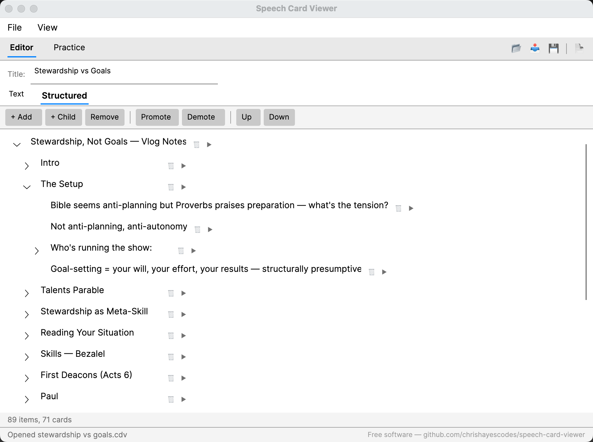
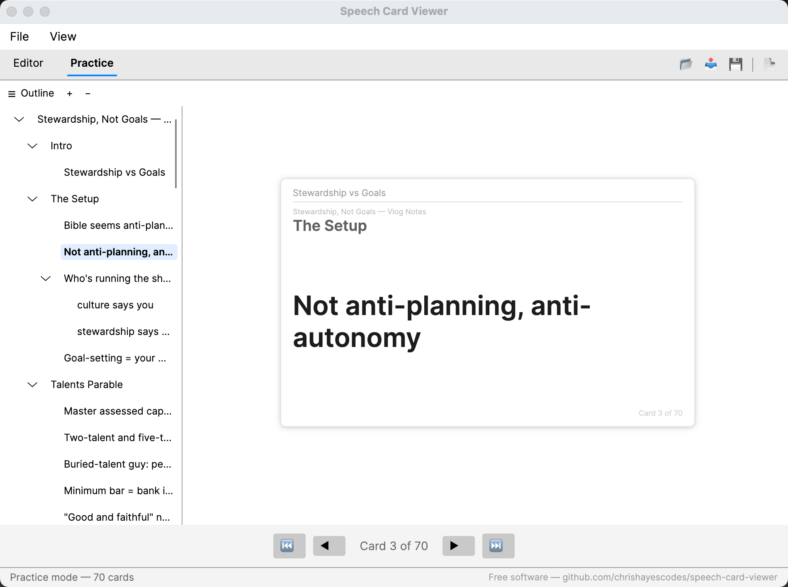

# Speech Card Viewer

A cross-platform desktop app for creating speech outlines and practicing with virtual 3x5 index cards. Built with [Avalonia UI](https://avaloniaui.net/), .NET 8, and [QuestPDF](https://www.questpdf.com/).

## What It Does

Write a speech outline in a text or structured editor, then flip through it as a deck of virtual index cards. Each card shows your current place in the outline hierarchy, the topic, and any bullet points — just like real 3x5 cards you'd bring to a podium.

- **Editor** with two modes: freeform text (markdown headers or indentation) and a structured tree editor
- **Practice mode** with card navigation, chapter jumping, and a resizable outline sidebar
- **PDF export** to printable 5x3" index cards
- **File support** for `.cdv` (native), `.md`/`.txt` (import), and legacy `.cardviewer.json` formats

See [FEATURES.md](FEATURES.md) for the full feature list.

## Screenshots

| Text Editor | Structured Editor |
|-------------|-------------------|
|  |  |

| Practice Mode |
|---------------|
|  |

## Prerequisites

- [.NET 8 SDK](https://dotnet.microsoft.com/download/dotnet/8.0)

## Build and Run

```sh
dotnet run --project src/CardViewer
```

## Run Tests

```sh
dotnet test
```

## Project Structure

```
src/CardViewer/
  Models/          Outline, OutlineNode, SpeechCard data models
  Views/           Avalonia XAML views and code-behind
  ViewModels/      MVVM view models (CommunityToolkit.Mvvm)
  Services/        Parsing, card generation, file I/O, PDF export
  Converters/      Value converters for data binding

tests/CardViewer.Tests/
  xUnit tests for view models, parser, and card generator
```

## License

[MIT](LICENSE) — see [THIRD-PARTY-NOTICES](THIRD-PARTY-NOTICES) for dependency licenses.

PDF export uses [QuestPDF](https://www.questpdf.com/), which is free for open-source and companies with less than $1M annual revenue. Larger organizations should review [QuestPDF's license terms](https://www.questpdf.com/license/).

## Acknowledgments

Built with [Claude Code](https://claude.ai/claude-code).
